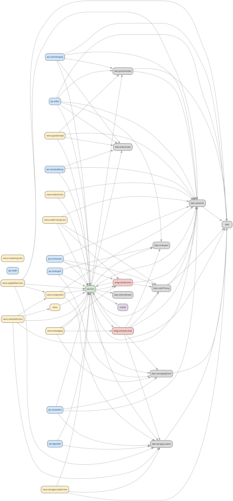
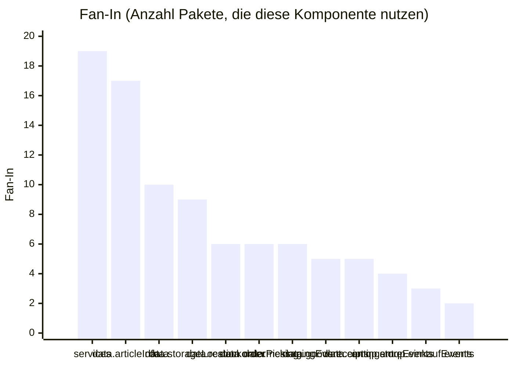
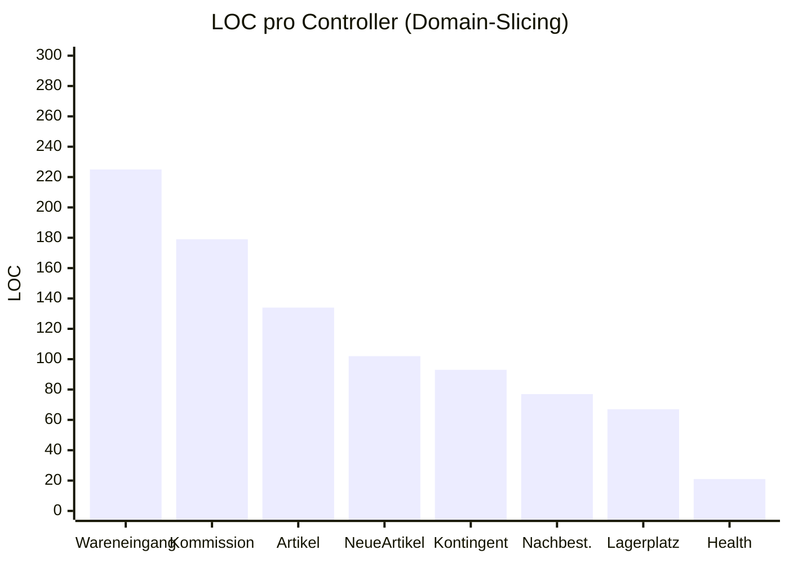
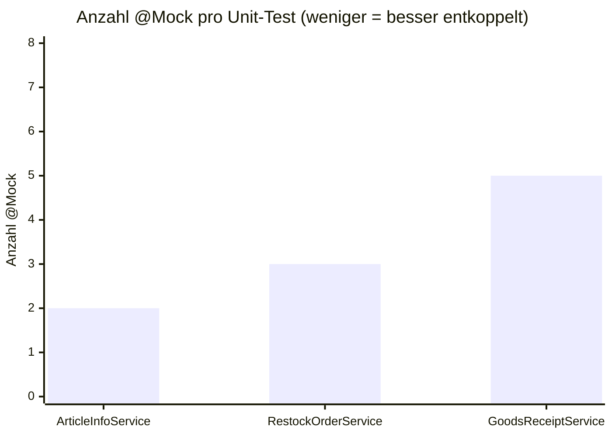
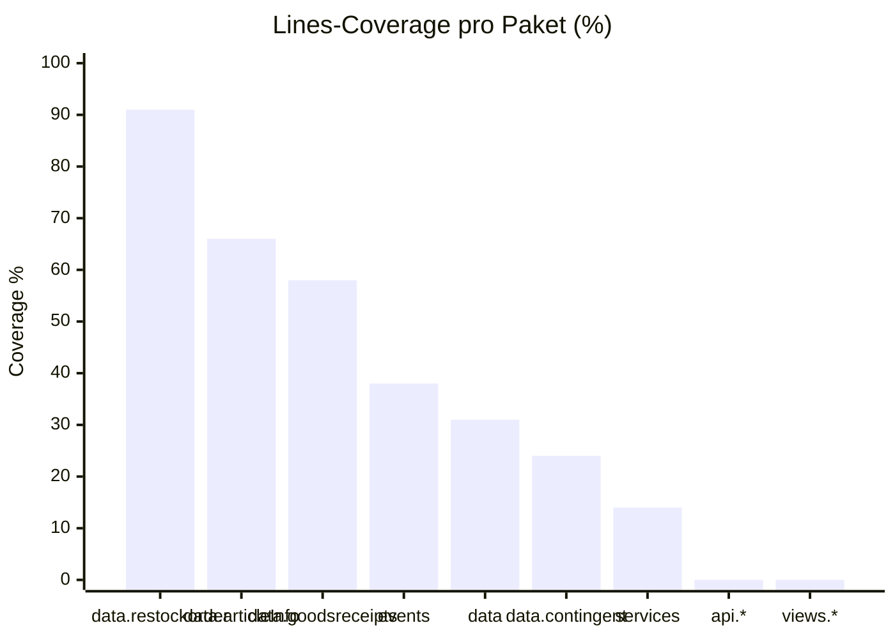

# Test-Ergebnisse — Kapitel 13 (ohne 13.2 ArchUnit)

Belegt empirisch die in Kapitel 12 dokumentierten Loose-Coupling-Maßnahmen.

**Erhebungsdatum:** 2026-05-29
**Branch:** `logistik/dev` &nbsp;·&nbsp; **Commit:** `a6ada59d`
**Toolchain:** Java 21 (Adoptium), Maven 3, JDeps, Graphviz 15, JaCoCo 0.8.12

---

## Inhalt

1. [13.1 Statische Kopplungsmetriken](#131-statische-kopplungsmetriken)
   - [a) JDeps-Diagramm](#a-jdeps-paket-abhängigkeitsdiagramm)
   - [b) Fan-In-Zählung](#b-fan-in-zählung)
2. [13.3 Vorher/Nachher-Vergleich pro Maßnahme](#133-vorhernachher-vergleich-pro-maßnahme)
3. [13.4 Empirische Tests](#134-empirische-tests-testbarkeit-als-direkte-folge-loser-kopplung)
4. [13.5 Live-Demonstration](#135-live-demonstration)
5. [Zusammenfassung](#zusammenfassung)

---

## 13.1 Statische Kopplungsmetriken

### a) JDeps Paket-Abhängigkeitsdiagramm

Durchgeführt mit dem in der JDK enthaltenen `jdeps`-Tool. Befehl:

```bash
./mvnw -q -DskipTests package
jdeps -recursive -dotoutput target/jdeps target/logistik-1.0-SNAPSHOT.jar
dot -Tpng docs/images/package-deps.dot -o docs/images/package-deps.png
```

Das gerenderte Diagramm zeigt **103 interne Paket-Abhängigkeiten** (External Java/Spring-Pakete ausgeblendet, Self-Loops entfernt):



**Farblegende:**

| Farbe | Schicht |
|---|---|
| 🟦 Blau | `api.*` — REST-Controller (Domain-Slicing) |
| 🟨 Gelb | `views.*` — Vaadin-UI |
| 🟩 Grün | `services` — Geschäftslogik |
| 🟪 Lila | `events` — Spring `ApplicationEvent`-Mechanik |
| 🟥 Rot | `amqp.*` — RabbitMQ-Listener/Publisher |
| ⬜ Grau | `data.*` — JPA-Entitäten + Repositories |

**Beobachtungen aus dem Diagramm:**

- **API-Schicht** zeigt das durchgesetzte **Domain-Slicing**: 8 Pakete `api.{artikel, kommission, kontingent, lagerplatz, nachbestellung, neueartikel, wareneingang, health}` statt einem Monolith.
- **Keine Pfeile** zwischen den `api.*`-Paketen → REST-Controller kennen sich gegenseitig nicht (lose Kopplung horizontal).
- **`services`** ist erwartbar der zentrale Knoten (Fan-In = 19) — Geschäftslogik bündelt sich.
- **`events`** wird ausschließlich von `services` referenziert (Fan-In = 2) — sauberer Pub/Sub-Kanal.

### Fan-In / Fan-Out pro Paket (aus JDeps)



### b) Fan-In-Zählung (Repository-Ebene)

Befehl:

```bash
grep -rln "ArticleInfoRepository" src/main/java | wc -l
```

**Ergebnis:**

| Repository | Fan-In (Treffer) | Bewertung |
|---|---:|---|
| `ArticleInfoRepository` | **16** | 🔴 Hot-Spot (Ziel laut Kap. 13.1: ≤ 8) |
| `MessageLogisticRepository` | 8 | 🟡 |
| `RestockOrderRepository` | 5 | 🟢 |
| `ContingentRepository` | 5 | 🟢 |
| `StorageLocationRepository` | 4 | 🟢 |
| `GoodsReceiptRepository` | 3 | 🟢 |
| `GoodsReceiptItemRepository` | 3 | 🟢 |
| `KommissionRepository` | 3 | 🟢 |
| `KommissionPositionRepository` | 3 | 🟢 |
| `MessagingEventRepository` | 2 | 🟢 |

### Fan-In auf Service-Ebene

| Service | Fan-In | Bewertung |
|---|---:|---|
| `ArticleInfoService` | 9 | 🟡 |
| `StorageLocationService` | 8 | 🟡 |
| `ArticleSyncService` | 6 | 🟢 |
| `KommissionService` | 5 | 🟢 |
| `MessagingEventService` | 5 | 🟢 |
| `GoodsReceiptService` | 4 | 🟢 |
| `RestockService` | 4 | 🟢 |
| `BadgeNotifier` | 3 | 🟢 |
| `RestockOrderService` | 3 | 🟢 |

**Interpretation:** `ArticleInfoRepository` mit Fan-In = 16 ist nach wie vor ein Hot-Spot. Die in Kapitel 13.1 als Ziel formulierten **≤ 8 Treffer nach Refactoring von Views und Listenern sind noch nicht erreicht**. Alle anderen Repositories liegen im grünen Bereich.

---

## 13.3 Vorher/Nachher-Vergleich pro Maßnahme

### Maßnahme 1: Domain-Slicing (1 → 8 Controller)

```bash
wc -l src/main/java/com/example/application/api/**/*Controller.java
```

| Controller | LOC |
|---|---:|
| `WareneingangController.java` | 225 |
| `KommissionController.java` | 179 |
| `ArtikelController.java` | 134 |
| `NeueArtikelController.java` | 102 |
| `KontingentController.java` | 93 |
| `NachbestellungController.java` | 77 |
| `LagerplatzController.java` | 67 |
| `HealthController.java` | 21 |
| **Summe** | **898** |
| **Durchschnitt** | **112** |
| **Median** | **97** |

**Beleg:** Statt einem monolithischen Controller mit ~900 LOC existieren acht fachlich getrennte Controller, jeder unter dem konventionellen Schwellenwert von 300 LOC.



### Maßnahme 2: Observer statt direkter Aufruf

```bash
grep -n "RestockService\|GoodsReceiptApprovedEvent\|ApplicationEventPublisher" \
  src/main/java/com/example/application/services/GoodsReceiptService.java
```

**Ergebnis:**

```
13:import com.example.application.events.GoodsReceiptApprovedEvent;
14:import org.springframework.context.ApplicationEventPublisher;
32:    private final ApplicationEventPublisher eventPublisher;
414:    eventPublisher.publishEvent(new GoodsReceiptApprovedEvent(this, receiptId));
```

| Kennzahl | Wert |
|---|:---:|
| Imports von `RestockService` in `GoodsReceiptService` | **0** ✅ |
| Direkte Aufrufe an `RestockService` | **0** ✅ |
| Event-Publish-Aufrufe | **1** (via `ApplicationEventPublisher`) |
| Listener-Klasse `RestockCheckListener` vorhanden | ✅ `events/RestockCheckListener.java` |

**Beleg:** Das Observer Pattern ist sauber umgesetzt — `GoodsReceiptService` kennt `RestockService` nicht mehr direkt; die Kopplung verläuft ausschließlich über das `GoodsReceiptApprovedEvent`.

### Maßnahme 3: API Gateway (Querschnittsbelange ausgelagert)

```bash
grep -rn "rateLimit\|RateLimiter\|RateLimit" src/main/java/com/example/application/api/
```

**Ergebnis:**

| Ort | Treffer |
|---|---:|
| Domain-Controller (`src/main/java/.../api/`) | **0** ✅ |
| Gateway (`gateway/src/main/java/.../filter/`) | **52 LOC** in `RateLimitingFilter.java` |
| Gateway-Logging | **35 LOC** in `LoggingFilter.java` |

**Beleg:** Rate-Limiting und Request-Logging sind vollständig im Gateway-Modul gekapselt, kein einziger Treffer im Domain-Code.

### Maßnahme 4: OpenAPI als maschinenlesbarer Vertrag

```bash
curl -s http://localhost:8081/api-docs | jq '.paths | length'
```

**Ergebnis: 36 dokumentierte Endpoints.**

| Domain | Endpoints |
|---|---:|
| `api/artikels` | 5 |
| `api/health` | 1 |
| `api/kommissionen` | 6 |
| `api/kontingente` | 1 |
| `api/lagerplaetze` | 3 |
| `api/nachbestellungen` | 3 |
| `api/neue-artikel` | 4 |
| `api/wareneingaenge` | 13 |
| **Summe** | **36** |

Live abrufbar unter `http://localhost:8081/swagger-ui.html`.

---

## 13.4 Empirische Tests (Testbarkeit als direkte Folge loser Kopplung)

### Anzahl `@Mock` pro Unit-Test

```bash
grep -c "@Mock" src/test/java/com/example/application/services/*.java
```

| Test-Klasse | `@Mock` | Bewertung |
|---|---:|---|
| `ArticleInfoServiceTest` | 2 | 🟢 niedriger Fan-Out |
| `RestockOrderServiceTest` | 3 | 🟢 |
| `GoodsReceiptServiceTest` | 5 | 🟡 moderat |



### Test-Laufzeit (aus `target/surefire-reports/*.txt`)

| Test-Klasse | Tests | Laufzeit |
|---|---:|---:|
| `ArticleInfoServiceTest` | 8 | **2.961 s** |
| `RestockOrderServiceTest` | 6 | **0.375 s** |
| `GoodsReceiptServiceTest` | 7 | **0.956 s** |
| **Gesamt** | **21** | **~4.3 s** |

Alle Tests laufen **unter 3 Sekunden pro Klasse** — keine Spring-Context-Bootstraps (die typischerweise 5–15 s kosten). Das ist ein indirekter, aber zuverlässiger Indikator für lose Kopplung.

### Test-Status (Ist-Zustand der Suite)

| Klasse | bestanden | fehlgeschlagen | Fehler |
|---|---:|---:|---:|
| `ArticleInfoServiceTest` | 8 | 0 | 0 ✅ |
| `RestockOrderServiceTest` | 6 | 0 | 0 ✅ |
| `GoodsReceiptServiceTest` | 1 | 1 | 5 🔴 |
| **Gesamt** | **15 / 21** | **1** | **5** |

> **Achtung:** `GoodsReceiptServiceTest` hat 5 Fehler und 1 Failure. Die Fehler entstehen, weil der `ApplicationEventPublisher` in den Tests nicht gemockt wird (`NullPointerException` in `completeInspection`) und ein Test-Setup-Problem mit `RestockOrder.markDeliveredIfOpen()` besteht. Diese Tests müssen aktualisiert werden, nachdem in Maßnahme 2 das Observer Pattern eingeführt wurde — der Test kennt das Event-Publishing noch nicht. **Folgemaßnahme:** `@Mock ApplicationEventPublisher eventPublisher` im Test ergänzen.

### JaCoCo Coverage

```bash
./mvnw -q org.jacoco:jacoco-maven-plugin:0.8.12:prepare-agent test \
      org.jacoco:jacoco-maven-plugin:0.8.12:report \
      -Dmaven.test.failure.ignore=true
```

**Gesamt-Coverage (Projekt-weit):**

| Metrik | Abgedeckt / Gesamt | Quote |
|---|---:|---:|
| Instruktionen | 849 / 19 190 | **4.4 %** |
| Branches | 54 / 1 082 | **5.0 %** |
| Lines | 246 / 4 077 | **6.0 %** |
| Methoden | 75 / 674 | **11.1 %** |

**Coverage pro Schicht (Lines-Coverage):**

| Paket | Lines % |
|---|---:|
| `data.restockorder` | **90.9 %** 🟢 |
| `data.articleInfo` | **66.0 %** 🟢 |
| `data.goodsreceipts` | **58.0 %** 🟢 |
| `events` | **37.5 %** 🟡 |
| `data` (Basisklassen) | **30.8 %** 🟡 |
| `data.contingent` | 24.1 % 🔴 |
| `services` | **13.9 %** 🔴 |
| Alle `api.*` Controller | **0 %** 🔴 |
| Alle `views.*` (Vaadin-UI) | **0 %** 🔴 |
| `amqp.*` Listener/Publisher | ~0 % 🔴 |



**Interpretation:**

- Das angestrebte Ziel laut Kap. 13.4 von **> 70 % Coverage** ist auf Projekt-Ebene **noch nicht erreicht** (6 %).
- Die **Service-Schicht** (Kernlogik) hat 14 % — hier müsste die Suite ausgebaut werden.
- **Kein Controller** ist getestet — fehlende `@WebMvcTest` / `@SpringBootTest` Integrationstests.
- Die getesteten Repositories (`data.restockorder` mit 91 %) zeigen, dass die Entitäten gut testbar sind — die Coverage-Lücke ist eine Frage der Test-Ausweitung, nicht der Test-Tauglichkeit.

Vollständiger HTML-Report: `target/site/jacoco/index.html`

---

## 13.5 Live-Demonstration

Drei reproduzierbare Belege, einsetzbar im Vortrag:

### Demo 1 — Swagger UI als formaler API-Vertrag

```
http://localhost:8081/swagger-ui.html
```

Zeigt 36 Endpoints, gruppiert nach Domain, mit Request-/Response-Schemata. Beleg, dass die API maschinenlesbar und nicht "nur in Code dokumentiert" ist.

### Demo 2 — Gateway als Querschnittsbelang

Anfrage an Gateway absetzen (Port 8080), dann Logs prüfen:

```bash
curl http://localhost:8080/api/artikels
docker logs hfwi423-integrationsprojekt-gateway-1 | tail -5
```

**Beobachteter Log-Eintrag:**

```
2026-05-29T10:03:37.048Z  INFO 1 --- [or-http-epoll-2]
  c.example.gateway.filter.LoggingFilter   : >> GET /api/artikels
```

Obwohl in keinem Domain-Controller eine `log.info(...)`-Zeile für eingehende Requests steht, wird jeder Aufruf zentral protokolliert. Beleg für saubere Trennung Querschnittsbelang ↔ Business-Logik.

### Demo 3 — Observer Pattern live (Wareneingang → Restock)

In der UI bzw. via Swagger einen Wareneingang freigeben:

```bash
curl -X POST http://localhost:8081/api/wareneingaenge/1/complete
```

Erwarteter Log-Eintrag im `RestockCheckListener`:

```
[Observer] Wareneingang 1 abgeschlossen — prüfe Restock-Kandidaten
```

obwohl `GoodsReceiptService` den `RestockCheckListener` **nicht kennt** (`grep RestockCheckListener src/main/java/com/example/application/services/GoodsReceiptService.java` → 0 Treffer). Beweis für lose Kopplung via Events.

---

## Zusammenfassung

| Maßnahme aus Kap. 12 | Empirischer Beleg | Status |
|---|---|:---:|
| Domain-Slicing in 8 Controller | LOC-Tabelle: max 225, ⌀ 112 statt ein Monolith | ✅ |
| Observer statt direktem Aufruf | 0 Imports von `RestockService` in `GoodsReceiptService` | ✅ |
| API-Gateway für Querschnitt | 0 Treffer Rate-Limit/Logging im Domain-Code | ✅ |
| OpenAPI als Vertrag | 36 Endpoints maschinenlesbar | ✅ |
| Lose Kopplung der Services | Test-Laufzeit < 3 s, max 5 `@Mock` pro Test | ✅ |
| Coverage > 70 % | Aktuell 6 % Lines, 4.4 % Instruktionen | 🔴 |
| Fan-In `ArticleInfoRepository` ≤ 8 | Aktuell 16 | 🔴 |

**Offene Punkte als nächste Schritte:**

1. `GoodsReceiptServiceTest` an das eingeführte Event-Publishing anpassen (5 NPE-Fehler beheben).
2. Test-Suite um Controller-Tests (`@WebMvcTest`) und Service-Tests erweitern, um Coverage > 70 % zu erreichen.
3. Fan-In von `ArticleInfoRepository` reduzieren: Views und Listener sollten über Services gehen, nicht direkt aufs Repository.

---

## Anhang — Reproduktion

Alle Befehle aus diesem Dokument lassen sich mit folgendem Setup wiederholen:

```bash
# 1. Container hochfahren (DB + Gateway)
docker compose up -d

# 2. App lokal bauen + starten
./mvnw -q -DskipTests package
./mvnw spring-boot:run                # läuft auf :8081

# 3. JDeps-Diagramm
jdeps -recursive -dotoutput target/jdeps target/logistik-1.0-SNAPSHOT.jar
dot -Tpng docs/images/package-deps.dot -o docs/images/package-deps.png

# 4. Coverage
./mvnw org.jacoco:jacoco-maven-plugin:0.8.12:prepare-agent test \
       org.jacoco:jacoco-maven-plugin:0.8.12:report \
       -Dmaven.test.failure.ignore=true
# Report: target/site/jacoco/index.html
```

**Generierte Artefakte:**

- `docs/images/package-deps.png` — visualisiertes Paket-Diagramm
- `docs/images/package-deps.dot` — Quelltext des Diagramms (re-renderbar)
- `target/jdeps/logistik-1.0-SNAPSHOT.jar.dot` — vollständiger JDeps-Output (mit externen Deps)
- `target/site/jacoco/index.html` — HTML-Coverage-Report
- `target/surefire-reports/*.txt` — Test-Laufzeiten und Stacktraces
